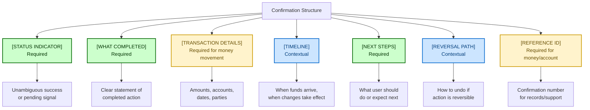

# Confirmation/Success Pattern Anatomy with Compliance Hooks

## What is it good for?

In financial services, a confirmation isn't just a nicety — it's a legal receipt. Users need to know what happened, verify the details are correct, and understand what comes next. Getting this wrong in a money context erodes trust faster than any other pattern.

This anatomy adapts [DCT Pattern 5: Confirmation/Success](../distributed-coherence-toolkit/02-adaptive-content-patterns.md) for regulated financial services.

<aside>

**Scenario:** A user just transferred $5,000 between accounts. They need unambiguous proof it happened, exact details to verify, and clarity about when funds are available. Use this anatomy to assemble the confirmation.

</aside>

## Core Structure

Every confirmation message has these anatomical parts, some required, some contextual:



## Anatomical Rules

### 1. STATUS INDICATOR

- **Always present**: Users must know the action succeeded (or is pending)
- **Format**: Clear, affirmative statement — not just an icon
- **Differentiate**: Success vs. pending vs. partial completion

```yaml
required: true
states:
  complete: "confirmed" | "complete" | "successful"
  pending: "submitted" | "processing" | "pending"
  partial: "partially complete" — explain what remains
never:
  - ambiguous_language: "Your request has been received" # (Does that mean it worked?)
```

### 2. WHAT COMPLETED

- **Always present**: Name the specific action in user terms
- **Format**: Past tense, user as subject (or passive if clearer)
- **Length**: 5-12 words max

```yaml
required: true
max_words: 12
tense: past
voice:
  user_initiated: "You transferred $5,000 to Savings"
  system_initiated: "Your scheduled payment was sent"
```

### 3. TRANSACTION DETAILS

- **Required for**: Money movement, account changes, document submissions
- **Format**: Structured key-value pairs, not prose
- **Precision**: Exact amounts, full account identifiers (masked appropriately), exact dates

```yaml
required_when:
  - money_movement
  - account_change
  - document_submission
format: key_value_pairs
masking:
  account_numbers: show_last_4
  ssn: never_display
  routing_numbers: show_last_4
precision:
  amounts: exact_to_cent
  dates: full_date_with_year
  times: include_timezone
```

### 4. TIMELINE

- **Include when**: Action has future effects (processing time, settlement)
- **Format**: Specific dates/times, not vague ("soon," "shortly")
- **Compliance**: Never guarantee exact timing unless system-confirmed

```yaml
required: false
trigger_conditions:
  - processing_delay
  - settlement_period
  - scheduled_future_action
format: specific_date_or_range
forbidden:
  - vague_timing: ["soon", "shortly", "in a few days"]
  - guarantees_without_system_confirmation: true
```

### 5. NEXT STEPS

- **Always present**: Even if the next step is "nothing — you're done"
- **Format**: Verb + specific action (or explicit "no action needed")
- **Prioritize**: Most important action first

```yaml
required: true
format: "{verb} {specific_action}" | "No further action needed"
priority_order:
  1: immediate_required_action
  2: recommended_follow_up
  3: informational
```

### 6. REVERSAL PATH

- **Include when**: Action is reversible within a window
- **Format**: Clear time window + how to reverse
- **Compliance**: State exact cutoff, not approximate

```yaml
required: false
trigger_conditions:
  - action_reversible: true
  - reversal_window_exists: true
format: "{action} within {exact_timeframe} from {location}"
```

### 7. REFERENCE ID

- **Required for**: All money movement, account changes, submissions
- **Format**: Prefixed, copyable, include in all channels

```yaml
required_when:
  - money_movement
  - account_change
  - document_submission
  - support_may_be_needed
format: "{prefix}-{id}"
display: copyable
```

## Composition Examples

### Low Risk: Settings Updated

```
[STATUS] Updated
[WHAT] Your notification preferences were saved
[NEXT] No further action needed. Changes take effect immediately.
```

*Minimal elements — low stakes, no money, no compliance concerns.*

### High Risk: Fund Transfer

```
[STATUS] ✓ Transfer confirmed
[WHAT] You transferred $5,000.00 from Checking (•••4821) to Savings (•••7903)
[DETAILS]
  Amount: $5,000.00
  From: Checking •••4821
  To: Savings •••7903
  Date: March 22, 2026
[TIMELINE] Funds available in Savings by end of business day, March 22, 2026
[NEXT] No further action needed
[REVERSAL] Cancel this transfer within 30 minutes from Activity → Recent Transfers
[REF] Confirmation: TRF-2026032247821
```

*All elements included for high-stakes financial transaction.*

### Medium Risk: Document Submission

```
[STATUS] Submitted for review
[WHAT] Your beneficiary change request was submitted
[DETAILS]
  Change: Add Jane Doe as primary beneficiary
  Account: IRA •••3156
  Submitted: March 22, 2026 at 2:45 PM PT
[TIMELINE] Reviews typically complete within 3-5 business days. We'll email you when it's processed.
[NEXT] No action needed while we review. You can check status anytime in Documents → Pending.
[REF] Request: BEN-2026032233156
```

*Pending state with clear timeline expectations.*

## Channel Adaptations

### Mobile (Compressed)

- Lead with STATUS + WHAT in one line
- DETAILS collapsible (show amount + accounts, hide dates)
- REFERENCE copyable with single tap
- REVERSAL as prominent button if applicable

### Email Receipt (Comprehensive)

- Full DETAILS with all fields
- TIMELINE prominent
- REFERENCE in subject line and body
- REVERSAL instructions with deep link
- Legal footer with dispute instructions

### Push Notification (Minimal)

- STATUS + WHAT only
- Tap to see full confirmation
- Under 50 characters

```
✓ $5,000 transferred to Savings. Tap for details.
```

## Compliance Hooks

```yaml
compliance_hooks:
  forbidden_constructions:
    - forward_looking_guarantees_on_timing
    - implied_fdic_coverage_without_disclosure
    - unmasked_full_account_numbers
  required_disclosures:
    money_movement:
      - processing_timeline_or_range
      - reversal_availability
    account_changes:
      - effective_date
      - confirmation_method
  audit_fields:
    - transaction_type
    - confirmation_id
    - timestamp_utc
    - channel
    - user_session_id
```

## YAML Schema

```yaml
confirmation_anatomy:
  required:
    status_indicator:
      states: [complete, pending, partial]
      format: unambiguous_affirmative
    what_completed:
      max_words: 12
      tense: past
    next_steps:
      format: "{verb} {action}" | "No further action needed"
  required_when_financial:
    transaction_details:
      format: key_value_pairs
      precision: exact
      masking: show_last_4
    reference_id:
      format: "{prefix}-{id}"
      display: copyable
  conditional:
    timeline:
      include_if:
        - processing_delay
        - settlement_period
      forbidden: [vague_timing, unconfirmed_guarantees]
    reversal_path:
      include_if:
        - action_reversible
      format: "{action} within {exact_timeframe}"
  tone_modifiers:
    success: { warmth: 0.7, urgency: 0.1 }
    pending: { warmth: 0.4, urgency: 0.3 }
    partial: { warmth: 0.3, urgency: 0.5 }
```

---

[← Back to README](README.md) | [Related: Error Pattern Anatomy](pattern-anatomy.md) | [Related: Help Pattern](help-pattern.md)
