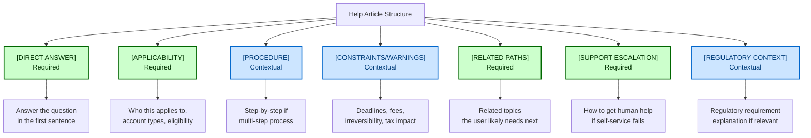

# Help/Documentation Pattern Anatomy with Compliance Hooks

## What is it good for?

In financial services, help content isn't just support — it's a compliance surface. Users seeking answers about their money are often anxious, confused, or making consequential decisions. Getting self-service content wrong means higher support costs, compliance risk, and eroded trust.

This anatomy adapts [DCT Pattern 4: Help/Documentation](../distributed-coherence-toolkit/02-adaptive-content-patterns.md) for regulated financial services.

<aside>

**Scenario:** A user searches "how do I change my beneficiary?" This is a high-stakes, compliance-heavy action most users do rarely. The help content needs to be accurate enough for legal, clear enough for a first-timer, and complete enough to avoid a support call.

</aside>

## Core Structure

Every help article has these anatomical parts, some required, some contextual:



## Anatomical Rules

### 1. DIRECT ANSWER

- **Always present**: Answer the question in the first sentence
- **Format**: Plain statement, not a heading or preamble
- **Rule**: If you can't answer in one sentence, lead with the most important fact

```yaml
required: true
position: first_sentence
format: declarative_statement
max_words_first_sentence: 25
never:
  - lead_with_preamble: "Before we get started..." | "Great question!"
  - delay_answer_past_first_paragraph: true
```

### 2. APPLICABILITY

- **Always present**: Users need to know if this applies to them
- **Format**: Account types, eligibility, or conditions stated clearly
- **Position**: Immediately after direct answer

```yaml
required: true
position: after_direct_answer
includes:
  - account_types_affected
  - eligibility_requirements
  - geographic_restrictions_if_any
format: "This applies to {scope}. If you have {exception}, see {alternative}."
```

### 3. PROCEDURE

- **Include when**: Answer involves multiple steps
- **Format**: Numbered steps, one action per step
- **Rule**: Each step starts with a verb; each step is independently verifiable

```yaml
required: false
trigger_conditions:
  - multi_step_process: true
  - user_needs_to_take_action: true
format: numbered_steps
rules:
  - one_action_per_step: true
  - start_with_verb: true
  - independently_verifiable: true
  - include_location: "Go to {section} > {page}" # not "click the gear icon"
max_steps: 7 # if more, break into sub-procedures
```

### 4. CONSTRAINTS/WARNINGS

- **Include when**: Action has deadlines, fees, tax implications, or irreversibility
- **Format**: Callout box or bold prefix — not buried in body text
- **Compliance**: Constraints must be stated before the action, not after

```yaml
required: false
trigger_conditions:
  - fees_involved: true
  - deadline_exists: true
  - tax_implications: true
  - irreversible_action: true
  - regulatory_requirement: true
position: before_relevant_step # NEVER after
format: callout_or_bold_prefix
severity_levels:
  critical: "Important: {constraint}" # fees, irreversibility
  informational: "Note: {constraint}" # processing times, limits
```

### 5. RELATED PATHS

- **Always present**: Users rarely have just one question
- **Format**: 2-4 related topics, phrased as user goals (not article titles)

```yaml
required: true
count: 2-4
format: user_goal_phrasing # "Change your address" not "Address Change Policy"
placement: end_of_article
relevance: task_adjacent # what users typically need next
```

### 6. SUPPORT ESCALATION

- **Always present**: Every help article needs a human escape hatch
- **Format**: Channel + availability + what to have ready

```yaml
required: true
placement: end_of_article
includes:
  - support_channel: [phone, chat, secure_message]
  - availability: hours_and_timezone
  - preparation: "Have your {reference_info} ready"
```

### 7. REGULATORY CONTEXT

- **Include when**: User needs to understand why a process exists
- **Format**: Brief, plain-language explanation — not legal text
- **Rule**: Explain the regulation's purpose, not its citation

```yaml
required: false
trigger_conditions:
  - regulatory_requirement_drives_process: true
  - user_may_question_why: true
format: plain_language_explanation
never:
  - raw_regulation_citation_without_explanation: true
  - legal_jargon_without_definition: true
example: "Federal regulations require us to verify your identity when you change beneficiaries. This protects you from unauthorized changes."
```

## Composition Examples

### Simple: "How do I view my statements?"

```
[ANSWER] Your monthly statements are available in Documents.
[APPLICABILITY] Available for all account types. Statements going back 7 years are accessible online.
[PROCEDURE]
1. Go to Documents > Statements
2. Select the account
3. Choose the statement period
4. Select View or Download
[RELATED]
- Set up paperless statements
- Understand your statement
- Download tax documents
[SUPPORT] Questions about a specific charge? Chat with us (Mon-Fri 8am-8pm ET) or call 1-800-XXX-XXXX.
```

### Complex: "How do I change my beneficiary?"

```
[ANSWER] You can change your beneficiary online for most retirement and insurance accounts.
[APPLICABILITY] Available for IRA, 401(k) rollover, and life insurance accounts. For trust-held accounts, contact us directly.

[WARNING] Important: Changing your beneficiary may have tax implications. Consider consulting a tax advisor before making changes. Beneficiary changes for retirement accounts may require spousal consent if you're married.

[PROCEDURE]
1. Go to Account Settings > Beneficiaries
2. Select the account you want to update
3. Choose Add, Edit, or Remove beneficiary
4. Enter the beneficiary's full legal name, date of birth, and Social Security number
5. Assign the percentage allocation (must total 100%)
6. Review the summary and confirm

[TIMELINE] Changes are typically reviewed within 3-5 business days. You'll receive an email when the change is processed.

[REGULATORY] Federal regulations require us to verify your identity when you change beneficiaries. This protects you from unauthorized changes to your account.

[RELATED]
- Understand primary vs. contingent beneficiaries
- What happens if you don't name a beneficiary
- Update your beneficiary after a life event

[SUPPORT] Need help? Call 1-800-XXX-XXXX (Mon-Fri 8am-8pm ET). Have your account number ready.
```

## Channel Adaptations

### In-App Contextual Help (Compressed)

- ANSWER only, with "Learn more" link to full article
- No PROCEDURE (user is already in the UI)
- CONSTRAINTS surfaced as inline warnings near relevant fields

### AI Chat/Search (Conversational)

- Lead with ANSWER
- APPLICABILITY as follow-up question: "What type of account is this for?"
- PROCEDURE delivered one step at a time
- SUPPORT ESCALATION offered if user struggles

### Mobile (Scannable)

- ANSWER as header
- PROCEDURE as collapsible section
- CONSTRAINTS as callout cards
- SUPPORT as sticky footer button

## Compliance Hooks

```yaml
compliance_hooks:
  forbidden_constructions:
    - financial_advice: "You should invest in..." | "The best option is..."
    - guaranteed_outcomes: "This will save you money"
    - unauthorized_tax_guidance: specific tax calculations without advisor disclaimer
  required_elements:
    tax_related_topics:
      - advisor_consultation_suggestion
    investment_related_topics:
      - risk_disclosure_or_link
    account_change_topics:
      - identity_verification_notice
  review_triggers:
    - new_regulatory_topic: true
    - fee_or_pricing_mentioned: true
    - investment_product_referenced: true
  freshness:
    regulatory_content: review_quarterly
    fee_schedules: review_on_change
    procedures: review_on_product_update
```

## YAML Schema

```yaml
help_article_anatomy:
  required:
    direct_answer:
      position: first_sentence
      max_words: 25
      format: declarative
    applicability:
      includes: [account_types, eligibility, exceptions]
    related_paths:
      count: 2-4
      format: user_goal_phrasing
    support_escalation:
      includes: [channel, availability, preparation]
  conditional:
    procedure:
      include_if: multi_step_process
      format: numbered_steps
      max_steps: 7
      rules: [one_action_per_step, start_with_verb]
    constraints:
      include_if:
        - fees_involved
        - deadline_exists
        - tax_implications
        - irreversible_action
      position: before_relevant_step
    regulatory_context:
      include_if: regulation_drives_process
      format: plain_language
  tone_modifiers:
    informational: { warmth: 0.6, urgency: 0.1 }
    high_stakes: { warmth: 0.4, urgency: 0.3 }
    troubleshooting: { warmth: 0.5, urgency: 0.4 }
```

---

[← Back to README](README.md) | [Related: Error Pattern Anatomy](pattern-anatomy.md) | [Related: Confirmation Pattern](confirmation-pattern.md)
