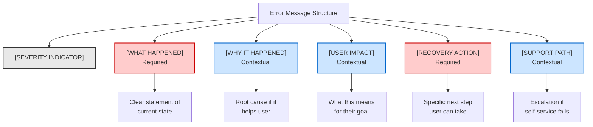

# Pattern Anatomy with Compliance Hooks

## What is it good for?

Patterns are great until you hit a case the examples don't cover. This section turns "copy-and-paste the closest thing" into "assemble the right message from core parts," so anyone can handle new situations without guesswork.

<aside>

**Scenario:** A new upload limit or payment verification error appears with no prior example. Use anatomy to assemble the message on day one and keep it compliant.

</aside>

## ❌ Pattern Library Approach (Doesn't Scale)

```
"Good error message examples:
• 'Invalid email address'
• 'Password must be 8+ characters'
• 'Network connection lost'
• 'File upload failed'"
```

## ✅ Systematic Pattern Anatomy (Scales & Adapts)

### Core Structure

Every error message has these anatomical parts, some required, some contextual:



## Anatomical Rules

### 1. WHAT HAPPENED

- **Always present**: Users need to know the current state
- **Format**: Past tense for completed failures, present tense for ongoing issues
- **Length**: 5-10 words max
- **Voice**: Active when system caused it, passive when unclear

```yaml
required: true
max_words: 10
tense:
	completed: past
	ongoing: present
voice:
	system_fault: active
	unclear_fault: passive
```

### 2. WHY IT HAPPENED

- **Include when**: User can prevent recurrence OR needs technical context
- **Exclude when**: Cause is obvious OR too technical OR security-sensitive
- **Format**: Because + root cause
- **Length**: 10-15 words max

```yaml
required: false
trigger_conditions:
  user_preventable: true
  disambiguation_needed: true
exclude_conditions:
  security_risk: true
  overly_technical: true
max_words: 15
```

### 3. USER IMPACT

- **Include when**: Consequences aren't immediately obvious
- **Format**: This means + impact statement
- **Focus**: User's goal, not system state

```yaml
required: false
trigger_conditions:
  - data_loss: true
  - service_interruption: true
  - delayed_processing: true
format: "This means {impact_on_user_goal}"
```

### 4. RECOVERY ACTION

- **Always present**: Every error needs an escape path
- **Format**: Verb + specific action
- **Prioritize**: Most likely successful action first
- **Fallback**: Always include support option if no self-service path

```yaml
required: true
format: "{verb} {specific_action}"
priority_order:
  1: immediate_retry
  2: user_correction
  3: wait_and_retry
  4: contact_support
```

### 5. SUPPORT PATH

- **Include when**: Self-service unlikely to succeed
- **Format**: If problem persists + support channel
- **Context**: Include error code/ID for support

```yaml
required: false
trigger_conditions:
  - repeated_failure: true
  - no_user_action: true
  - critical_service: true
format: "If this continues, {support_action}"
include_error_id: true
```

## Composition Examples

### Low Risk + User Fixable

```
[WHAT] Your email address isn't valid
[RECOVERY] Check for typos and try again
```

*Only required elements, maximum conciseness*

### High Risk + Technical Issue

```
[SEVERITY] ⚠️ Payment Error
[WHAT] Your payment couldn't be processed
[WHY] The bank declined this transaction
[IMPACT] Your order hasn't been placed
[RECOVERY] Try a different payment method
[SUPPORT] If this continues, contact support (Error: PAY-4429)
```

*All elements included for high-stakes scenario*

### System Error + No User Action

```
[WHAT] We couldn't load your dashboard
[WHY] Our servers are experiencing high load
[RECOVERY] Refreshing in 30 seconds...
[SUPPORT] Check system status at status.example.com
```

*Auto-recovery with transparency*

## Channel Adaptations

The anatomy adapts to context while maintaining structure:

### Mobile (Compressed)

- Combine WHAT + RECOVERY in one line
- Hide WHY unless requested
- Truncate SUPPORT to icon

### Voice/Audio (Sequential)

- Lead with SEVERITY tone
- State WHAT happened
- Pause
- Provide RECOVERY action
- Repeat if needed

### API (Structured)

```json
{
  "error": {
    "what": "Invalid authentication token",
    "why": "Token expired after 24 hours",
    "impact": "Request not processed",
    "recovery": "Generate new token at /auth/refresh",
    "support": { "needed": false, "error_id": "AUTH-1001" }
  }
}
```

## AI Implementation Prompt DRAFT

```markdown
When generating error messages, use this anatomy:

REQUIRED PARTS:
What happened (state the problem in <10 words)
Recovery action (specific verb + action)

CONTEXTUAL PARTS (include when relevant):
Why (only if user-preventable or needs context)
Impact (only if consequences unclear)
Support (only if self-service likely to fail)

TONE: Match severity
- Critical: Urgent but not alarming
- Warning: Clear but calm
- Info: Neutral and helpful

NEVER:
- Blame the user
- Use technical jargon without explanation
- Leave user without next step
- Apologize excessively
```

## Governance & Evolution

### Adding New Patterns

1. Identify gap in current anatomy
2. Define new contextual rule
3. Test across 10+ real scenarios
4. Document trigger conditions
5. Update AI prompts

### Quality Checklist

- [ ]  All required parts present?
- [ ]  Contextual parts justified?
- [ ]  User can take action?
- [ ]  Tone matches severity?
- [ ]  Works across channels?

---

*This anatomical approach means new team members can construct appropriate error messages for novel situations without needing hundreds of examples. The system is generative, not just prescriptive.*

## Complete YAML Schema

```yaml
error_message_anatomy:
  required:
    what_happened:
      max_words: 10
      tense:
        completed_failure: past
        ongoing_issue: present
      voice:
        system_fault: active
        unclear_fault: passive
    recovery_action:
      format: "{verb} {specific_action}"
      priority_order:
        - immediate_retry
        - user_correction
        - wait_and_retry
        - contact_support
  conditional:
    why:
      include_if:
        - user_preventable
        - needs_disambiguation
      exclude_if:
        - security_risk
        - overly_technical
      max_words: 15
    impact:
      include_if:
        - data_loss
        - service_interruption
        - delayed_processing
      format: "This means {impact_on_user_goal}"
    support:
      include_if:
        - repeated_failure
        - no_user_action
        - critical_service
      format: "If this continues, {support_action}"
      include_error_id: true
compliance_hooks:
  forbidden_constructions:
    - forward_looking_guarantees
    - misleading_certainty
    - unverifiable_claims
  attribution:
    - system_state
    - partner_bank_response
    - policy_reference
```

---

[← Back to README](README.md) | [← Previous: Decision Frameworks](decision-frameworks.md) | [Next: Principle Hierarchy →](principle-hierarchy.md)
